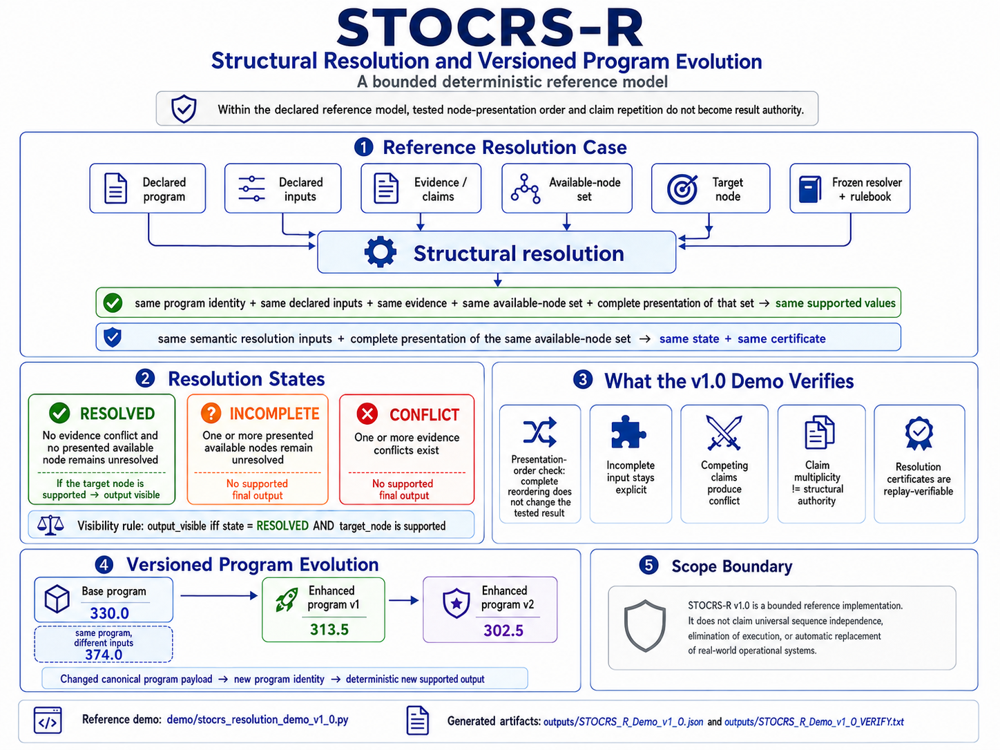

# ⭐ **STOCRS-R**  

## **STOCRS-Resolution — Structural Resolution Without Sequential Programming**


---

**Where structure resolves and output becomes visible.**

This reference demonstration explores a strict invariant:

**output correctness does not require procedural sequencing as the source of correctness.**

It depends only on structure.

`output_visible iff structure_complete AND structure_consistent`

---

## 🌐 **STOCRS-R — Structural Resolution Layer**

**Correctness Without Sequential Reconstruction**

STOCRS-R extends STOCRS —

structural correctness without sequence or synchronization —

into practical structural application evolution.

[STOCRS](https://github.com/OMPSHUNYAYA/STOCRS)

Traditional systems assume:

`execution -> sequence -> synchronization -> correctness`

STOCRS-R demonstrates:

`output = resolve(structure)`

Correctness emerges from:

- declarations  
- structural relationships  
- dependency admissibility  
- deterministic resolution  
- reusable structural continuity  

—not from procedural sequencing.

---

## ⚡ **The Claim**

Applications can evolve through reusable structure without reconstructing execution flow.

---

## 🧱 **Core Principle**

`output_visible iff structure_complete AND structure_consistent`

STOCRS-R demonstrates that deterministic application correctness emerges from structure — not by sequential execution pipelines.

Execution may reveal the output.

**Structure determines correctness.**

---

## ⚡ **The One-Line Breakthrough**

`correctness = structure`

---

## ⚡ **30-Second Demonstration**

Run:

```
python demo/stocrs_r_demo_v0_3.py
```

Expected demonstration states:

- same structure -> same output  
- same structure -> same certificate  
- small structural mutation -> upgraded deterministic output  
- incomplete structure -> INCOMPLETE  
- conflicting structure -> CONFLICT  

---

## 🧩 **Structural Vocabulary (Quick Reference)**

| Symbol | Meaning |
|---|---|
| `structure_complete` | All required structural declarations are present |
| `structure_consistent` | No contradictions exist in structural relationships |
| `resolve(structure)` | Deterministic structural resolution function |
| `output_visible` | True only when structure is complete AND consistent |
| `certificate (σ)` | Deterministic structural fingerprint |
| `RESOLVED` | Output admitted |
| `INCOMPLETE` | Structural absence |
| `CONFLICT` | Structural contradiction |

---

## 🚀 **The Core Insight**

Traditional programming assumes:

`logic -> execution -> output`

STOCRS-R demonstrates:

`structure -> resolution -> output`

This changes the enhancement model itself.

Traditional enhancement often requires:

- rebuilding execution flow  
- reworking procedural logic  
- reconstructing integration pipelines  
- modifying synchronization paths  

STOCRS-R demonstrates:

`small structural mutation -> deterministic upgraded output`

without redesigning the resolver.

---

## 🧱 **The Unifying Principle**

`output = resolve(structure)`

If correctness remains after removing a dependency, that dependency was never fundamental.

---

## ⚙️ **Minimal Operational Semantics (Phase I)**

STOCRS-R models correctness through deterministic structural admissibility.

Given:

`S = structural state`

Resolution semantics:

`resolve(S) -> RESOLVED`
iff
`complete(S) AND consistent(S)`

`resolve(S) -> INCOMPLETE`
iff
`NOT complete(S)`

`resolve(S) -> CONFLICT`
iff
`contradiction(S)`

Visibility semantics:

`output_visible iff resolve(S) = RESOLVED`

Replay semantics:

`S1 = S2 -> Output1 = Output2 -> Certificate1 = Certificate2`

Procedural realizations do not affect admissibility:

`resolve(S, P1) = resolve(S, P2)`

for all admissible procedural realizations `P1`, `P2`.

Thus:

`procedural_variation != correctness_variation`

Correctness remains a property of structure.

Not procedural sequencing.

---

## 🧩 **Structural Resolution Demonstration**

The v0.2 -> v0.3 transition demonstrates a critical property:

Only a tiny policy mutation changed.

The resolver remained intact.  
The architecture remained intact.  
The reusable structure remained intact.

Yet:

a new deterministic output emerged.

This demonstrates:

`enhancement != reconstruction`

---

## 🔁 **Determinism & Reproducibility**

STOCRS-R treats application correctness as a reproducible structural artifact.

`same structure -> same output -> same certificate`

`same resolver + same structure -> same upgraded output`

This enables:

- deterministic regeneration  
- replay verification  
- reusable structural templates  
- deterministic upgrades  
- structural continuity  
- replay-safe enhancement  
- minimal mutation evolution  

---

## 📊 **Comparison**

| Model | Sequential Reconstruction Required | Structure-Based | Deterministic |
|---|---|---|---|
| Traditional Programming | Yes | Partial | Conditional |
| Template Systems | Partial | Partial | Conditional |
| STOCRS-R | No | Yes | Yes |

---

## 🌍 **Civilizational Direction**

Traditional software systems scale through:

- larger execution pipelines  
- increasing synchronization  
- procedural reconstruction  
- repeated redesign  

STOCRS-R explores a different direction:

- reusable correctness  
- deterministic upgrades  
- structure-first evolution  
- replay-safe enhancement  
- structural continuity across systems  

---

## ⚠️ **Clarification — Structural Resolution**

STOCRS-R does not claim:

- elimination of programming languages  
- elimination of execution environments  
- replacement of all software systems  
- guaranteed runtime superiority  

What it demonstrates:

Correctness does not require procedural sequencing as the source of truth.

Execution may reveal output.

Structure determines admissibility.

---

## ❓ **How STOCRS-R Differs from Declarative Programming, Datalog, or Constraint Solvers**

While there is conceptual overlap, STOCRS-R is distinct in focus, guarantees, and enhancement behavior.

### Primary Focus

STOCRS-R focuses on:

- deterministic application evolution
- replay-safe structural continuity
- reusable structural correctness
- deterministic admissibility preservation

rather than:

- query answering
- logic inference
- execution planning
- rule derivation

---

## ⚠️ **Known Limitations (Phase I)**

Phase I is intentionally minimal and focuses on isolating the structural invariant as clearly as possible.

Current limitations include:

- reference implementation is intentionally minimal (`pure Python + standard library only`)
- no built-in persistence, distributed resolution, or large-scale orchestration support yet
- performance characteristics and scalability behavior are not yet formally benchmarked
- focus remains deterministic correctness and admissibility — not runtime optimization
- formal machine-checked proofs (`Coq`, `Lean`, or equivalent systems) are planned for future phases
- production deployment requires independent validation and domain-specific testing

These limitations are deliberate.

Minimal systems isolate structural truth more clearly.

Phase I focuses specifically on demonstrating:

`same structure -> same output -> same certificate`

and:

`small structural mutation -> deterministic upgraded output`

without requiring procedural sequencing as the source of correctness.

---

### Core Safety Guarantee

STOCRS-R treats safe absence as a first-class structural property.

If structure does not resolve:

- `INCOMPLETE`
- `CONFLICT`

then:

`output is not visible`

No forced admissibility occurs.

No arbitrary output is produced.

Absence is treated as structural truth — not merely as an execution error condition.

---

### Structural Enhancement Model

STOCRS-R enhancement preserves:

- resolver continuity
- replay determinism
- admissibility continuity
- deterministic certificates

Small admissible structural mutation may produce:

`deterministic upgraded output`

without modifying the resolver itself.

This enables:

- structural inheritance across versions
- replay-safe upgrades
- reusable structural continuity
- minimal mutation enhancement

---

### Procedural Independence

STOCRS-R correctness remains invariant across:

- execution orders
- replay paths
- orchestration flows
- procedural realizations

Invariant:

`same structure -> same output -> same certificate`

across all admissible procedural realizations.

---

### Relationship to Declarative Systems

STOCRS-R may coexist with declarative systems and can function conceptually as a:

`structural correctness and admissibility layer`

beneath declarative execution systems.

However, STOCRS-R introduces stricter replay and admissibility guarantees centered around:

- deterministic structural replay
- safe absence semantics
- reusable structural evolution
- procedural independence of correctness
- deterministic structural certificates

---

## ⚡ **What STOCRS-R Demonstrates Clearly**

Phase I strongly demonstrates:

- deterministic structural application evolution  
- replay-safe correctness  
- reusable structural continuity  
- enhancement through minimal structural mutation  
- deterministic output regeneration  
- conflict-safe admissibility  
- structure-defined correctness visibility  

The current scope focuses on minimal structural proof systems.

Future systems may extend these principles into large-scale reusable structural applications.

---

## 🧠 **Practical Interpretation**

Use execution systems for capability.

Use STOCRS-R to define correctness structurally.

---

## 🧭 **Visual Overview**



Future versions may include:

- reusable structural graphs  
- multi-module structural continuity  
- declarative enhancement overlays  
- structural application templates  
- replay-safe upgrade systems  

Invariant remains:

`output = resolve(structure)`

---

## 🔥 **Break This STOCRS-R**

If sequential programming is required for correctness, this invariant must fail:

`same structure -> same output -> same certificate`

Or demonstrate:

- incomplete structure -> forced output  
- conflicting structure -> arbitrary output  
- structural replay -> divergent output  

If none occur, sequential dependency is not fundamental.

---

## ⚡ **The Critical Line**

Across structural systems:

remove dependency -> preserve structure -> correctness remains

---

## ⚡ **Structural Absence Principle**

If structure is incomplete or inconsistent:

output is not visible

`incomplete -> INCOMPLETE`

`conflict -> CONFLICT`

Absence is structural truth.

---

## 🧪 **Reference Demonstration**

### **Scenario 1 — Base Structure**
→ deterministic output visible

### **Scenario 2 — Replay Validation**
→ same structure -> same output -> same certificate

### **Scenario 3 — Reusable Template**
→ shared structural correctness reused

### **Scenario 4 — Structural Enhancement**
→ deterministic upgraded output through minimal mutation

### **Scenario 5 — Incomplete Structure**
→ INCOMPLETE

### **Scenario 6 — Conflicting Structure**
→ CONFLICT

---

## 🧩 **From Minimal Proof to Structural Application Evolution**

This reference engine isolates the structural invariant.

It is intentionally minimal.

Minimal systems isolate the truth.  
Larger systems demonstrate it at scale.

STOCRS-R explores how applications may evolve through:

- reusable correctness  
- structural continuity  
- deterministic replay  
- replay-safe upgrades  
- modular structural inheritance  
- declarative enhancement overlays  

The invariant remains identical:

`same structure -> same output -> same certificate`

Scale changes visibility.  
It does not change the structural principle.

---

## 🧭 **Framework & References**

### **Docs**

- [Quickstart](docs/Quickstart.md)
- [FAQ](docs/FAQ.md)
- [Proof Sketch](docs/Proof-Sketch.md)  
- [STOCRS-R Architecture Notes](docs/STOCRS-R-Architecture-Notes.md)
- [STOCRS-R Enhancement Model](docs/STOCRS-R-Enhancement-Model.md)
- [STOCRS-R Concept Diagram](docs/STOCRS-R-Diagram.png)  
- [Dependency Elimination Framework](docs/Dependency-Elimination-Framework.png)
- [Shunyaya Structural Stack](docs/Shunyaya-Structural-Stack.png)  

---

## 🧪 **Demo**

### **Reference Demonstrations**

- [stocrs_r_demo_v0_2.py](demo/stocrs_r_demo_v0_2.py)
- [stocrs_r_demo_v0_3.py](demo/stocrs_r_demo_v0_3.py)

---

## 🔐 **Verification & Outputs**

### **Output Artifacts**

- [STOCRS_R_Demo_v0_3.json](outputs/STOCRS_R_Demo_v0_3.json)
- [STOCRS_R_Demo_v0_3_VERIFY.txt](outputs/STOCRS_R_Demo_v0_3_VERIFY.txt)

---

## ⚡ **Quick Verification (60 Seconds)**

### 1. Run the Reference Demonstration

```
python demo/stocrs_r_demo_v0_3.py
```

---

### 2. Verify Determinism

Run the demo twice:

```
python demo/stocrs_r_demo_v0_3.py
python demo/stocrs_r_demo_v0_3.py
```

Expected:

- identical output
- identical admissibility states
- identical certificates

Core invariant:

`same structure -> same output -> same certificate`

---

## 🧩 **Expected Structural States**

| Structure State | Resolution State | Output Visibility |
|---|---|---|
| complete structure | `RESOLVED` | visible |
| incomplete structure | `INCOMPLETE` | absent |
| conflicting structure | `CONFLICT` | absent |

---

## 🔐 **File Integrity Check**

### Linux / macOS

```bash
sha256sum demo/stocrs_r_demo_v0_3.py
```

### Windows

```powershell
certutil -hashfile demo\stocrs_r_demo_v0_3.py SHA256
```

The hash must exactly match the value recorded in:

- `outputs/STOCRS_R_Demo_v0_3_VERIFY.txt`
- `VERIFY/FREEZE_DEMO_SHA256.txt`

---

## 🧠 **What Verification Confirms**

Successful verification demonstrates:

- deterministic structural resolution
- replay-safe correctness
- procedural-order independence
- safe absence under incomplete structure
- conflict-safe admissibility behavior
- deterministic certificate reproducibility

---

## 🔬 **Future Verification (Phase II)**

Future phases may expand verification toward:

- property-based testing (`Hypothesis`)
- formal machine-checked proofs (`Coq`, `Lean`, or equivalent systems)
- structural replay stress testing
- distributed admissibility verification
- large-scale deterministic replay validation

while preserving the invariant:

`same structure -> same output -> same certificate`

---

## 📁 **Repository Structure**

- `demo/` — structural resolution demonstrations  
- `outputs/` — deterministic outputs and verification artifacts  
- `docs/` — conceptual and framework documentation  
- `historical_scripts/` — structural evolution trace  

---

## 🛡 **Structural Safety & Guarantees**

STOCRS-R never forces correctness.

`incomplete -> no output`

`conflict -> no arbitrary output`

`complete -> deterministic output`

`same resolver + different admissible structure -> deterministic upgraded output`

---

## 🔥 **Deterministic Invariant**

`same structure -> same output -> same certificate`

---

## 🧾 **Relationship to STOCRS**

STOCRS established:

`correctness = structure`

STOCRS-R extends this into reusable deterministic application evolution.

---

## 🧭 **Structural Lineage**

SLANG -> correctness without execution  
STIME -> time  
STINT -> connectivity  
STILE -> communication  
SVARE -> computation  
STOCRS -> correctness without sequence or synchronization  
STOCRS-R -> reusable deterministic structural application evolution

---

## ⚖️ **What STOCRS-R Is / Is Not**

### **STOCRS-R IS:**

- a structural application evolution model  
- a deterministic structural resolution system  
- a proof that correctness can emerge from structure  
- a reusable structural enhancement framework  

### **STOCRS-R IS NOT:**

- a traditional sequential programming framework  
- a timing optimization system  
- a production-scale runtime replacement  
- a claim that execution environments disappear  

---

## 📜 **License**

See: [LICENSE](LICENSE)

### **Reference Implementation (This Repository):**

This STOCRS-R reference implementation scripts are released as an **Open Standard** —  
free to use, study, implement, extend, and deploy.

It represents a minimal deterministic demonstration of structural correctness resolution.

---

### **Architecture and Documentation:**

Licensed under CC BY-NC 4.0

---

## 🔭 **Roadmap**

### **Phase I (Current Reference Model)**

Current focus:

- minimal deterministic reference implementation
- replay-safe structural correctness
- structural enhancement model (`v0.2 -> v0.3`)
- deterministic certificates and replay verification
- comprehensive documentation and verification suite
- isolation of the core structural invariant

Core invariant:

`same structure -> same output -> same certificate`

---

### **Phase II (Tooling & Structural Runtime Layer)**

Planned exploration areas:

- STOCRS-R structural definition DSL
- reusable structural modules and overlays
- structural inheritance systems
- incremental / differential structural resolution
- interactive structural visualization systems
- admissibility graph inspection tools
- replay and certificate visualization
- additional reference implementations (`Rust`, `WebAssembly`, others)

Focus:

making structural admissibility easier to inspect, compose, replay, and evolve.

---

### **Phase III (Applied Structural Systems)**

Potential application domains include:

- finance and policy resolution systems
- workflow and orchestration correctness layers
- replay-safe upgrade systems
- governance and structural agreement systems
- deterministic audit and compliance layers
- AI / agent admissibility contracts
- structure-first distributed application models

Focus:

exploring where structural admissibility preserves correctness under procedural disorder.

---

### **Phase IV (Formalization & Research)**

Longer-term research directions include:

- machine-checked proofs of core invariants
- formal admissibility semantics
- structural replay convergence proofs
- distributed structural resolution research
- deterministic enhancement verification
- academic publication and peer review
- large-scale replay-stability analysis

Focus:

formalizing the structural correctness model mathematically and operationally.

---

## 🌌 **Long-Term Direction**

STOCRS-R explores whether correctness itself can become:

- structurally reusable
- replay-independent
- enhancement-stable
- procedurally invariant

The long-term direction is toward:

`structure-first deterministic systems`

where:

- correctness is structurally admissible
- replay remains deterministic
- upgrades preserve continuity
- procedural sequencing is not the source of correctness

---

## 🧱 **Cross-System Dependency Elimination Map**

Across these systems, the same structural pattern appears repeatedly.

The dependency changes.  
The preserved invariant does not.

| Domain        | System | Dependency Removed for Correctness                  | What Preserves Correctness |
|---------------|--------|------------------------------------|----------------------------|
| Computation   | [SLANG-Computation](https://github.com/OMPSHUNYAYA/SLANG-Computation) | Execution flow             | Structure |
| Computation   | [STOCRS](https://github.com/OMPSHUNYAYA/STOCRS)                     | Execution pipelines        | Structure |
| Arithmetic    | [SVARE](https://github.com/OMPSHUNYAYA/SVARE)                        | Computation                | Structure |
| Time          | [STIME](https://github.com/OMPSHUNYAYA/Structural-Time)              | Clocks                     | Structure |
| Time          | [SSUM-Time](https://github.com/OMPSHUNYAYA/SSUM-Time)                | Time reconstruction        | Structure |
| Ordering      | [ORL](https://github.com/OMPSHUNYAYA/Orderless-Ledger)              | Ordering / sequence        | Structure |
| Connectivity  | [STINT-Money](https://github.com/OMPSHUNYAYA/STINT-Money)           | Continuous connectivity    | Structure |
| Communication | [STILE](https://github.com/OMPSHUNYAYA/STILE)                       | Messaging / network        | Structure |
| Traversal     | [STRAL-Path](https://github.com/OMPSHUNYAYA/STRAL-Path)             | Traversal / search         | Structure |
| Infrastructure| [STIC](https://github.com/OMPSHUNYAYA/STIC)                         | Cloud / infrastructure     | Structure |
| Media         | [STRUMER](https://github.com/OMPSHUNYAYA/STRUMER)                    | Editing / manual media workflows | Structure |
| Finance       | [SLANG-Money](https://github.com/OMPSHUNYAYA/SLANG-Money)           | Transactions               | Structure |
| Audit         | [SLANG-Audit](https://github.com/OMPSHUNYAYA/SLANG-Audit)           | Verification workflows     | Structure |

Each row demonstrates removal of a dependency for correctness, while structure preserves correctness.

Correctness remains reproducible under structural constraints.

Dependencies may shift from runtime coordination toward structural definition, while preserving deterministic outcomes.

If correctness remains stable after removing a dependency, that dependency may not be fundamental to correctness.

---

## 🌌 **The Unifying Insight**

remove dependency -> preserve structure -> correctness remains

---

## 📝 **Note on Naming**

STOCRS-R extends STOCRS:

`Time • Order • Computation • Recovery • Synchronization — Reimagined Through Structure`

The focus is not procedural execution.

The focus is deterministic structural admissibility.

Shunyaya is an original modern structural and mathematical framework developed by the authors of the Shunyaya Framework.

It is distinct from Shunyata and is not a restatement of any prior philosophical term, doctrine, or traditional system.

---

## 🧭 **Final Statement**

Execution did not create correctness.  
Sequence did not create correctness.  
Synchronization did not create correctness.  

Structure determined the output.

When structure becomes complete and consistent:

output becomes visible

deterministically  
reproducibly  
through structural resolution

This is STOCRS-Resolution.

**This is STOCRS-R.**
